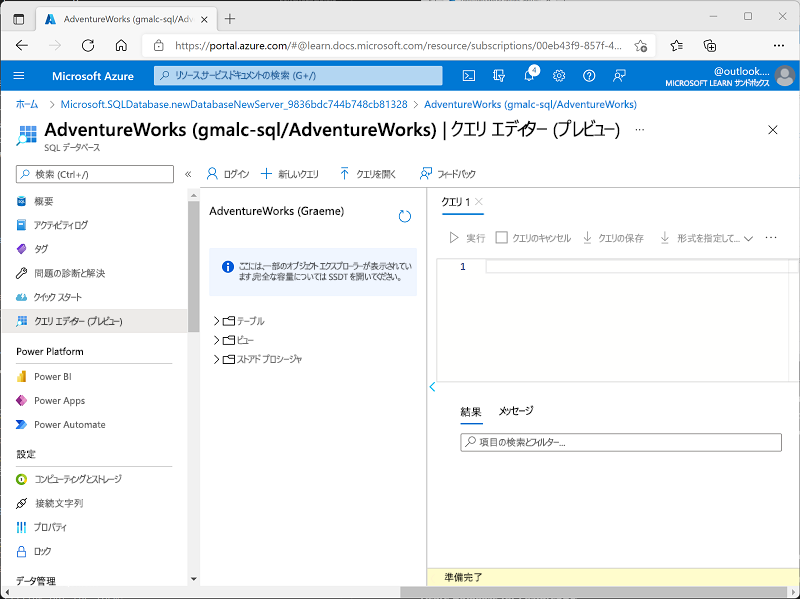

---
lab:
  title: Azure SQL Database について調べる
  module: Explore relational data in Azure
---

# Azure SQL Database について調べる

この演習では、 Azure SQL Database リソースをプロビジョニングし、SQL を使用してリレーショナル データベース内のテーブルに対してクエリを実行します。

※Skillable上の"DP-900T00-A Microsoft Azure Data Fundamentals [Cloud Slice Provided] JAPANESE, Learning Path 02 (CSS)"ラボで実施

このラボは完了するまで、約 **15** 分かかります。

## Azure SQL Database リソースをプロビジョニングする

1. [Azure portal](https://portal.azure.com?azure-portal=true) 上部の検索バーから、**[Azure SQL]** を検索して選択します。 表示された **[Azure SQL]** ブレードで**[+作成]** を選択します。

1. 使用可能な Azure SQL のオプションを確認し、**[SQL データベース]** タイルで **[単一データベース]** が選択して、**[作成]** を選択します。

    ![[Azure SQL] ページが表示された Azure portal のスクリーンショット。](images//azure-sql-portal.png)

1. **[SQL データベースの作成]** ページに次の値を入力し、他のすべてのプロパティは既定の設定のままにします。
    - **サブスクリプション**:既定のサブスクリプションを使用（選択済み）
    
    - **リソース グループ**: **ResourceGroup1**（作成済み）
    
    - **データベース名**: **AdventureWorks**
    
    - **サーバー**: **[新規作成]** をクリックし、以下の内容を入力します。入力完了後、OKをクリックして画面を戻します。
    
      ・**サーバー名**: **グローバルに一意な任意の名称**
    
      ・**場所**: **(US) East US**
    
      ・**認証方法**: **SQL認証を使用する**
    
      ・**サーバー管理者ログイン**: **sqluser**
    
      ・**パスワード**: **Pa55w.rdabc123**
    
      ・**パスワードの確認**: **Pa55w.rdabc123**
    
    - **SQL エラスティック プールを使用しますか?**: **いいえ**
    
    - **ワークロード環境**: **開発**
    
    - **コンピューティングとストレージ**: **汎用目的 - サーバーレス**（既定）
    
    - **バックアップ ストレージの冗長性**: **ローカル冗長バックアップ ストレージ**
    
1. **[SQL データベースの作成]** ページで、 **[次へ: ネットワーク]** を選択し、 **[ネットワーク]** ページの **[ネットワーク接続]** セクションで、 **[パブリック エンドポイント]** を選択します。 **[ファイアウォール規則]** セクションの両方のオプションに対して **[はい]** を選択すると、Azure サービスと現在のクライアント IP アドレスからデータベース サーバーへのアクセスが許可されます。

1. **[次へ: セキュリティ]** を選択し、 **[Microsoft Defender for SQL を有効にする]** オプションを **[後で]** に設定します。

1. **[次へ: 追加設定]** を選択し、 **[追加設定]** タブで、 **[既存のデータを使用します]** オプションを **[サンプル]** に設定します。これにより、後で利用できるサンプル データベースが作成されます。続行するか問われた場合は**[OK]**を選択します。

1. **[確認および作成]** を選択し、**[作成]** を選択して、Azure SQL データベースを作成します。

1. デプロイが完了するまで待ちます。 その後、デプロイされたリソースにアクセスすると、次のように表示されます。

    ![[SQL Database] ページが表示されている Azure portal のスクリーンショット。](images//sql-database-portal.png)

1. ページの左側のペインで、**[クエリ エディター (プレビュー)]** を選択し、サーバー用に指定した管理者のログインとパスワードを使用してサインインします。
   
                  "クライアント IP アドレスが許可されていないことを示すエラー メッセージが表示された場合は、メッセージの最後にある [Allowlist IP ...] (許可リスト IP...) リンクを選択してアクセスを許可し、もう一度サインインします (以前にご自身のコンピューターのクライアント IP アドレスをファイアウォール規則に追加していますが、ネットワーク構成によっては、クエリ エディターが異なるアドレスから接続されることがあります)。"
    
    クエリ エディターは次のようになります。
    
    

1. **テーブル** フォルダーを展開し、データベース内のテーブルを表示します。

1. **[クエリ 1]** ペインで、次の SQL コードを入力します。

    ```sql
    SELECT * FROM SalesLT.Product;
    ```

1. 入力範囲の上にある **[&#9655; 実行]** を選択して実行し、結果を表示します。**SalesLT.Product** テーブルにあるすべての行のすべての列が含まれています。

    

1. SELECT ステートメントを次のコードに置き換え、 **[&#9655; 実行]** を選択して新しいクエリを実行し、結果を確認します (**ProductID**、**Name**、**ListPrice**、**ProductCategoryID** の各列のみが含まれます)。

    ```sql
    SELECT ProductID, Name, ListPrice, ProductCategoryID
    FROM SalesLT.Product;
    ```

1. 次に、JOIN を使用して **SalesLT.ProductCategory** テーブルからカテゴリ名を取得する次のクエリを試してみましょう。

    ```sql
    SELECT p.ProductID, p.Name AS ProductName,
            c.Name AS Category, p.ListPrice
    FROM SalesLT.Product AS p
    JOIN [SalesLT].[ProductCategory] AS c
        ON p.ProductCategoryID = c.ProductCategoryID;
    ```

1. クエリ エディター ペインを閉じると、編集内容が破棄されます。
